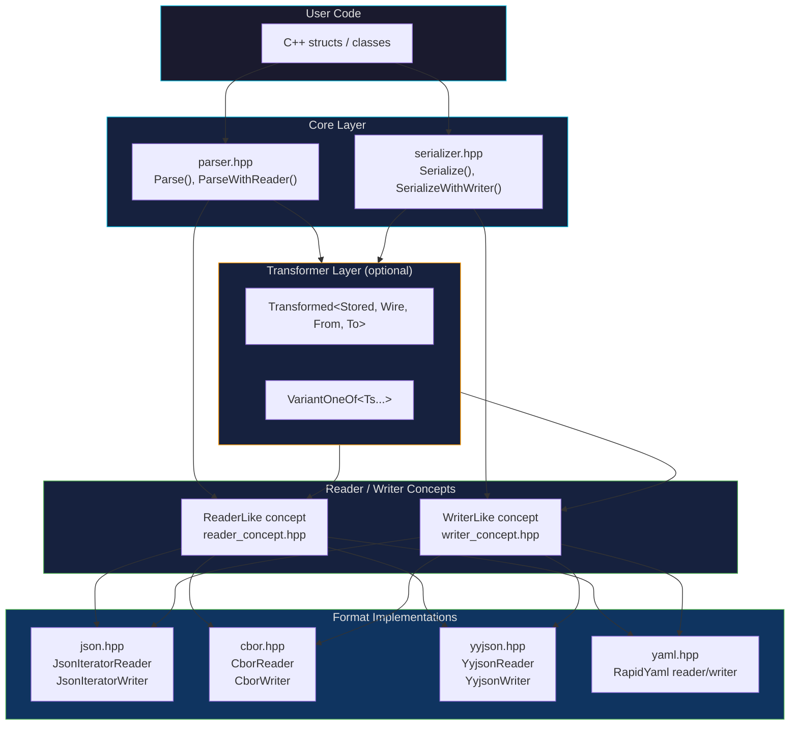
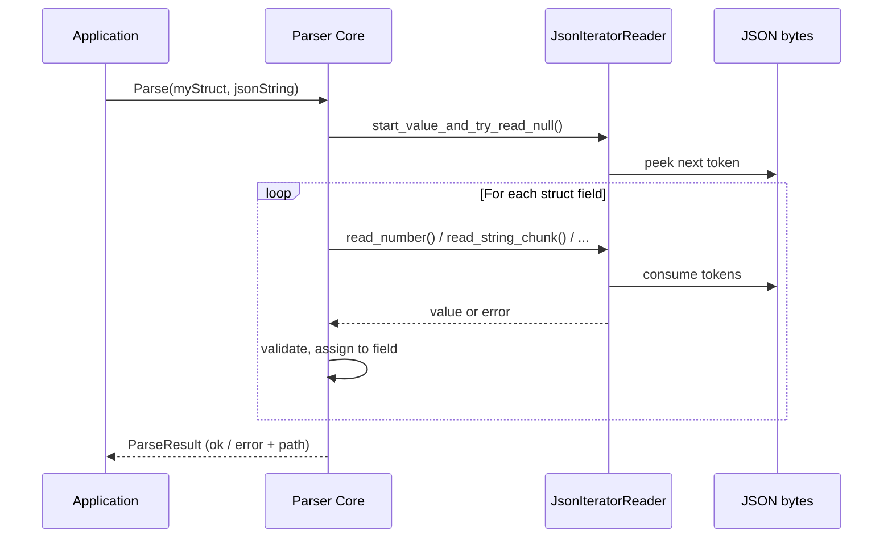

# Architecture

JsonFusion is a layered, zero-cost abstraction library. No virtual functions — everything
is resolved at compile time via C++20 concepts and templates.

## Layered Design



## How the layers work

**Core** (`parser.hpp`, `serializer.hpp`) contains the main `Parse()` and `Serialize()` functions.
They walk a C++ struct's fields at compile time using reflection, and delegate each value
to a **Reader** (for parsing) or **Writer** (for serialization).

**Reader/Writer concepts** (`reader_concept.hpp`, `writer_concept.hpp`) define the interface
that any format must implement — primitives, strings, arrays, maps, chunked I/O.
No base class — just C++20 concepts enforced at compile time.

**Format implementations** are concrete Reader/Writer pairs:

| Format | Header | Reader | Writer | Notes |
|--------|--------|--------|--------|-------|
| JSON | `json.hpp` | `JsonIteratorReader` | `JsonIteratorWriter` | Streaming, RFC 8259 |
| CBOR | `cbor.hpp` | `CborReader` | `CborWriter` | Binary, RFC 8949 |
| yyjson | `yyjson.hpp` | `YyjsonReader` | `YyjsonWriter` | DOM-based, optional fast backend |
| YAML | `yaml.hpp` | via rapidyaml | via rapidyaml | Uses rapidyaml library |

**Transformers** sit between the core and the wire format. They convert between
what the user stores (`StoredT`) and what appears on the wire (`WireT`):


Examples of transformers:
- `Transformed<std::chrono::time_point, std::string, parseISO, toISO>` — dates as ISO strings
- `VariantOneOf<int, std::string, Config>` — discriminated union, tries each alternative

## Data flow: parsing



## Key design decisions

- **No virtual dispatch**: Format selection is a template parameter, resolved at compile time
- **Streaming**: Readers/Writers process data incrementally — no need to load entire input
- **Chunked strings**: `read_string_chunk()` / `write_string_chunk()` enable fixed-buffer operation
- **Frame-based nesting**: Each array/map gets a `Frame` object tracking iteration state
- **WireSink**: Captures raw format bytes for passthrough between formats without re-parsing

## File map

```
include/JsonFusion/
├── Core
│   ├── parser.hpp              Parse(), DeserializationContext
│   ├── serializer.hpp          Serialize(), SerializationContext
│   ├── static_schema.hpp       Type concepts, cursor abstractions
│   └── options.hpp             Compile-time annotations
│
├── Reader/Writer
│   ├── reader_concept.hpp      ReaderLike concept definition
│   └── writer_concept.hpp      WriterLike concept definition
│
├── Formats
│   ├── json.hpp                JSON reader/writer (streaming)
│   ├── cbor.hpp                CBOR reader/writer (binary)
│   ├── yyjson.hpp              yyjson DOM reader/writer
│   └── yaml.hpp                YAML via rapidyaml
│
├── Transformers
│   ├── generic_transformers.hpp    Transformed<>, ArrayReduceField
│   └── variant_transformer.hpp    VariantOneOf<>
│
└── Support
    ├── wire_sink.hpp           Raw format capture/passthrough
    ├── validators.hpp          Schema constraint checking
    ├── errors.hpp              Error enumerations
    ├── parse_result.hpp        Result with error path tracking
    ├── annotated.hpp           Field annotation support
    ├── struct_introspection.hpp    Compile-time reflection
    └── json_schema.hpp         JSON Schema generation
```

[Back to Documentation](../index.md)
